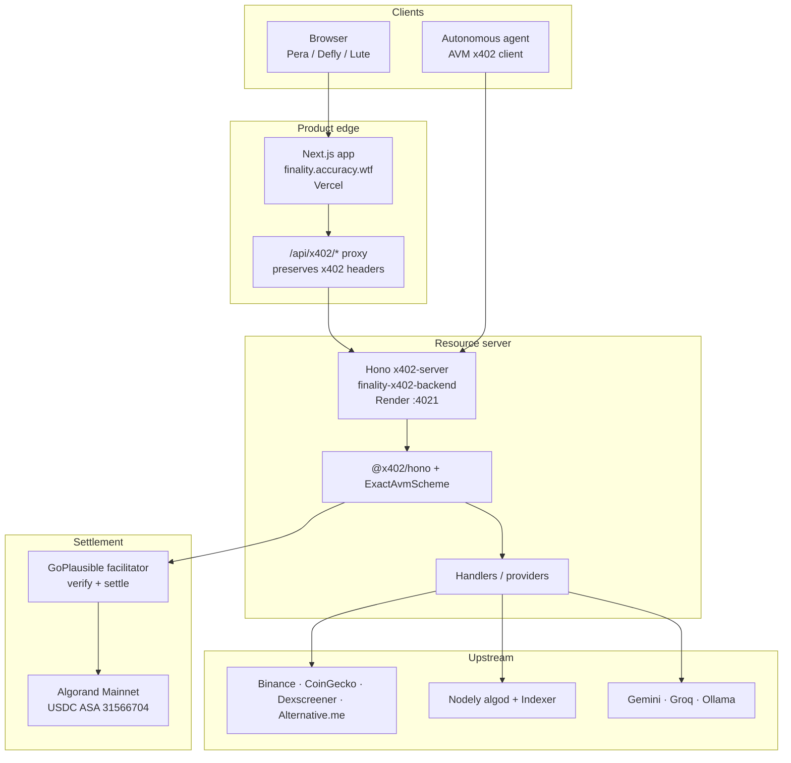
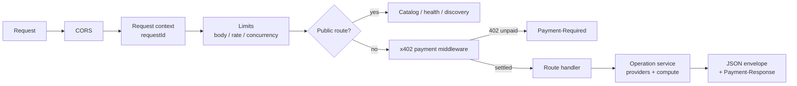
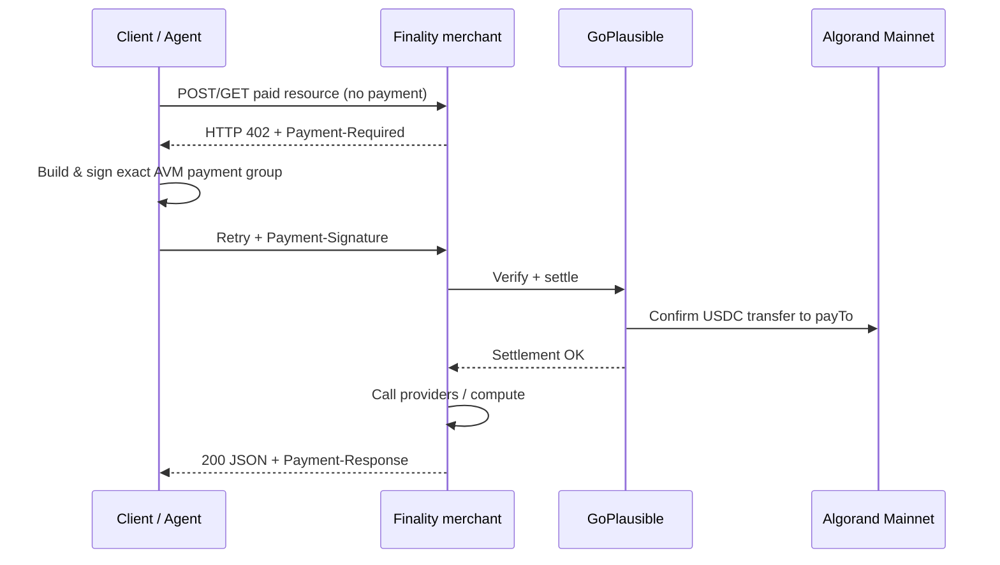

# Finality Market Intelligence

**Pay-per-result market, AI, and Algorand on-chain intelligence** for humans and autonomous agents — settled in **USDC on Algorand Mainnet** via the [x402](https://x402.org) protocol and the hosted [GoPlausible](https://goplausible.xyz) facilitator.

| Surface | URL |
| --- | --- |
| Product site | [https://finality.accuracy.wtf](https://finality.accuracy.wtf) |
| Merchant API | [https://finality-x402-backend.onrender.com](https://finality-x402-backend.onrender.com) |
| Health | [GET /health](https://finality-x402-backend.onrender.com/health) |
| Catalog | [GET /v1/catalog](https://finality-x402-backend.onrender.com/v1/catalog) |
| OpenAPI | [GET /v1/openapi.json](https://finality-x402-backend.onrender.com/v1/openapi.json) |
| Swagger UI | [https://finality.accuracy.wtf/docs](https://finality.accuracy.wtf/docs) |
| Explorer | [https://finality.accuracy.wtf/explore](https://finality.accuracy.wtf/explore) |

Finality is an **x402 resource server**, not a facilitator. GoPlausible verifies and settles every payment. The Next.js app is a non-custodial client only — it never holds an agent mnemonic or private key.

---

## Table of contents

- [Why Finality](#why-finality)
- [Architecture](#architecture)
- [Payment flow (x402)](#payment-flow-x402)
- [Repository layout](#repository-layout)
- [Quick start](#quick-start)
- [Environment](#environment)
- [API surface](#api-surface)
- [Data modes & providers](#data-modes--providers)
- [Security model](#security-model)
- [Verification](#verification)
- [Production deployment](#production-deployment)
- [Documentation](#documentation)

---

## Why Finality

- **One HTTP contract** for browsers and agents — same catalog, same prices, same envelopes.
- **Exact AVM USDC payments** — no message signatures, opaque proofs, or merchant-side mnemonics.
- **Discovery-first** — `/v1/catalog`, OpenAPI, `.well-known/x402`, and agent cards for GoPlausible Bazaar / x402 Global Challenge.
- **Fail-closed production** — `DATA_MODE=mock` and `ENABLE_DUMMY_ENDPOINT=true` are rejected when `NODE_ENV=production`.
- **Bounded inputs** — body size, symbol count, candles, rate, concurrency, and provider timeouts are capped.

---

## Architecture

### System context



### Trust boundaries

| Component | Role | Must not |
| --- | --- | --- |
| **Next.js** | UI, wallet adapter, same-origin proxy | Receive mnemonics; act as payment authority |
| **x402-server** | Advertise prices, gate routes, run providers | Store signed payloads or private keys |
| **GoPlausible** | Verify + settle exact AVM payments | Be replaced by a self-hosted / fallback facilitator |
| **Wallet / agent signer** | Sign the exact payment group | Share keys with Finality |

### Request pipeline (merchant)



### Internal layout

```text
finality-x402-challenge/
├── app/                      # Next.js App Router (landing, explore, docs, proxy)
│   └── api/x402/[...path]/  # Same-origin proxy → merchant (keeps x402 headers)
├── components/               # UI (wallet, explorer, landing)
├── lib/
│   ├── x402/client.ts        # Browser ExactAvmScheme paid fetch
│   ├── providers/            # Shared market / Nodely / mock helpers
│   └── contracts/            # Shared API / error shapes
├── x402-server/              # Canonical public merchant API (Hono)
│   ├── app.ts                # Middleware + route registration
│   ├── config/               # Env (zod), payment CAIP-2 / ASA, CORS
│   ├── middleware/           # x402, limits, errors, request context
│   ├── registry/             # endpoints.ts = source of truth for prices & paths
│   ├── discovery/            # Platform identity, well-known, agent cards
│   ├── routes/               # market · intelligence · agents · ai · onchain
│   ├── services/             # Operation execution
│   └── tests/                # Contract + unpaid + endpoint suites
├── scripts/                  # Dev runners, wallets, discovery & smoke checks
├── docs/                     # API reference & implementation contracts
├── .env.example              # Blank template only (safe to commit)
└── .gitignore                # Blocks .env*, *.pem, *.test-wallet.json
```

---

## Payment flow (x402)

Production rail: **Algorand Mainnet**, Circle **USDC ASA `31566704`**, facilitator **`https://facilitator.goplausible.xyz`**.



Language-neutral agent loop:

```text
response = HTTP.request(method, path, body)
if response.status == 402:
  requirement = decode(response.header["Payment-Required"])
  signed = agent_wallet.sign_exact_avm(requirement)
  response = HTTP.request(method, path, body,
                          headers={"Payment-Signature": signed})
assert response.status == 200
receipt = response.header["Payment-Response"]
```

**Rejected payment evidence:** `X-Payment-Proof`, payer address attestation, message-signature shortcuts, or any second facilitator.

---

## Quick start

**Requirements:** Node.js 20+, Mainnet ALGO for fees, Mainnet USDC (ASA `31566704`) opted-in on the payer wallet for live paid calls.

```bash
npm install
cp .env.example .env.local
cp .env.example x402-server/.env
```

Set `X402_PAYTO_ADDRESS` (dedicated merchant receiver) in `x402-server/.env`, then:

```bash
# Both services
npm run dev:all
# or
./scripts/run-finality.sh

# Separately
npm run dev:merchant    # → http://localhost:4021
npm run dev:frontend    # → http://localhost:3000
```

| Local surface | URL |
| --- | --- |
| Landing / wallet explorer | http://localhost:3000 |
| Swagger | http://localhost:3000/docs |
| Merchant API | http://localhost:4021 |

Inspect a challenge without spending:

```bash
curl -i 'http://localhost:4021/v1/market/quotes?symbols=BTC'
```

---

## Environment

| File | Consumer | Commit? |
| --- | --- | --- |
| `.env.example` | Template | Yes |
| `.env.local` | Next.js | **Never** |
| `x402-server/.env` | Merchant | **Never** |

Required for the paid Mainnet service:

- `X402_PAYTO_ADDRESS` — dedicated merchant account
- `X402_FACILITATOR_URL` — GoPlausible
- `X402_NETWORK=algorand-mainnet`
- `X402_USDC_ASA_ID=31566704`
- `X402_PUBLIC_URL` — public origin used in discovery resource URLs
- `X402_ALLOWED_ORIGINS` — comma-separated CORS allowlist
- Live provider path (durable crypto baseline needs no API key)

Optional: `COINGECKO_*`, `GROQ_API_KEY`, `GEMINI_API_KEY`, `OLLAMA_*`, Nodely tokens.

Test-only payer fields (`X402_TEST_PAYER_*`) belong only in `x402-server/.env`. Wallet JSON files (`*.test-wallet.json`) are gitignored — never force-add them.

---

## API surface

### Free discovery

| Method | Path | Purpose |
| --- | --- | --- |
| `GET` | `/health` | Component health & configured modes |
| `GET` | `/info` | Service, payment rail, discovery links |
| `GET` | `/v1/catalog` | Agent-readable prices, limits, operation IDs |
| `GET` | `/v1/openapi.json` | OpenAPI 3.1 |
| `GET` | `/.well-known/x402` | x402 / Bazaar discovery metadata |

### Paid product families

Canonical registry: [`x402-server/registry/endpoints.ts`](x402-server/registry/endpoints.ts). Full tables: [`docs/api-endpoints.md`](docs/api-endpoints.md).

| Family | Examples | Track |
| --- | --- | --- |
| **Market** | quotes, candles, trending, fear & greed, token prices | durable |
| **Intelligence** | signals, technicals, report, volume, events, backtest | quota-limited |
| **Agents** | decision, briefing, strategy parse | quota-limited |
| **AI** | data-grounded chat | quota-limited |
| **On-chain** | Indexer account/portfolio/asset/DeFi + Nodely algod reads | durable |

Prices are advertised in the `402` challenge — clients must not hardcode amounts.

---

## Data modes & providers

| Mode | Behavior |
| --- | --- |
| `live` | Real providers only; failures return explicit errors |
| `auto` | Live first; synthetic fallback only if `ALLOW_MOCK_FALLBACK=true` |
| `mock` | Deterministic fixtures for local/tests — **forbidden in production** |

Every response identifies source, provider, as-of time, freshness, limitations, availability track, data mode, and whether output is synthetic.

**Typical upstreams**

- Market: Binance public REST, CoinGecko, Dexscreener, Alternative.me
- Algorand: Nodely Mainnet algod + Indexer
- AI: Gemini / Groq / local Ollama (returns 503 if unavailable unless synthetic fallback is enabled)

DeFi routes report Indexer activity only — they never invent pool or liquidity metrics.

---

## Security model

- Merchant stores **no** mnemonic, private key, or raw signed payment payload.
- GoPlausible is the **only** facilitator; live mode fails closed.
- Browser signing via wallet adapters (Pera, Defly, Lute); agents use their own AVM signer.
- Inputs, body size, rate, concurrency, provider timeouts, and repeated upstream calls are bounded.
- Production boot rejects `DATA_MODE=mock` and `ENABLE_DUMMY_ENDPOINT=true`.
- Secrets stay in ignored env files; `.env.example` is empty placeholders + public config only.

---

## Verification

```bash
npm run build:x402
npm run test:x402
npx tsc --noEmit
```

Coverage includes discovery, OpenAPI, deterministic fixtures, production dummy-route exclusion, validation errors, and unpaid `402` challenges.

Live paid smoke (funded Mainnet wallet + network access):

```bash
npm run test:x402:testnet   # uses ignored test-wallet / env payer credentials
```

Discovery check:

```bash
npx tsx --env-file=x402-server/.env scripts/check-discovery.ts
```

---

## Production deployment

| Layer | Host | Notes |
| --- | --- | --- |
| Frontend | Vercel (`finality.accuracy.wtf`) | `NEXT_PUBLIC_*` point at merchant; proxy via `/api/x402` |
| Merchant | Render (`finality-x402-backend.onrender.com`) | `NODE_ENV=production`, Mainnet env, public URL for discovery |
| Facilitator | GoPlausible hosted | Do not self-host or dual-facilitator |

Checklist:

1. Dedicated `payTo` Mainnet account opted into USDC `31566704`.
2. `X402_PUBLIC_URL` equals the public merchant origin (required for Bazaar resource identity).
3. CORS allowlist includes the production site origin.
4. Confirm `/health`, `/v1/catalog`, and an unpaid paid-route `402` after deploy.
5. Never ship mock/dummy flags in production.

---

## Documentation

| Doc | Contents |
| --- | --- |
| [`docs/api-endpoints.md`](docs/api-endpoints.md) | Full endpoint & price reference |
| [`docs/final-product.md`](docs/final-product.md) | Product journeys (human + agent) |
| [`docs/final_implementation.md`](docs/final_implementation.md) | Implementation contract for contributors |

---

## License & challenge

Built for the **x402 Global Challenge** on Algorand — tags: `finality`, `x402`, `algorand`, `x402-global-challenge`.

Merchant identity and discovery metadata live in [`x402-server/discovery/platform.ts`](x402-server/discovery/platform.ts).
